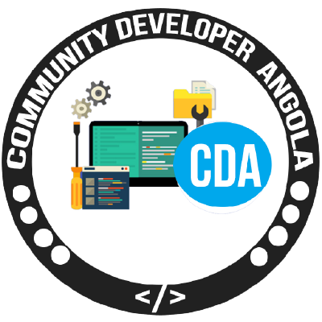

<p align="center">
  
  <h1 align="center">Joining-to-Community</h1>

  <p align="center">Community Dev Angola :rocket:</p>
</p>

Execute as seguintes tarefas e nós o convidaremos para se juntar à nossa comunidade

1. Faça o fork deste repositório para a sua conta do GitHub

2. Clone o repositório para a sua máquina local

    ```sh
    $ git clone "https://www.github.com/{username}/Joining-to-Community"
    ```

3. Vá para o diretório Joining-to-Community

    ```sh
    $ cd Joining-to-Community/
    ```

4. Crie uma branch com o nome do seu usuário GitHub

    ```sh
    $ git checkout -b {username}
    ```

5. Adicione o seu nome de perfil e o seu nome de usuário do GitHub na seção "**Membros da Organização**" no arquivo `CONTRIBUTORS.md`

6. Commit suas mudanças

    ```sh
    $ git add .
    $ git commit -m "Adicionando o {Fulano de tal}"
    ```

7. Faça o Push para o GitHub

    ```sh
    $ git push -u origin {nome da branch}
    ```

8. Acesse o repositório GitHub `Joining-to-Community` em sua conta

    - Abra uma Pull Request para o repositório da comunidade.

## OBS
O convite chegará no seu email depois que a sua Pull Request for aceite.<br/>
A Comunidade aguarda por você :)